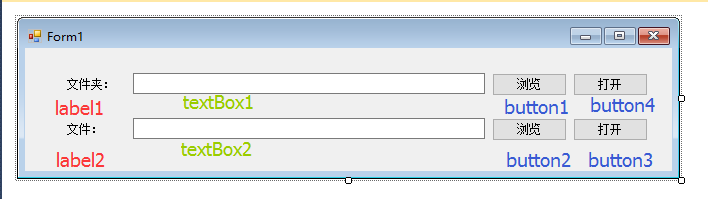
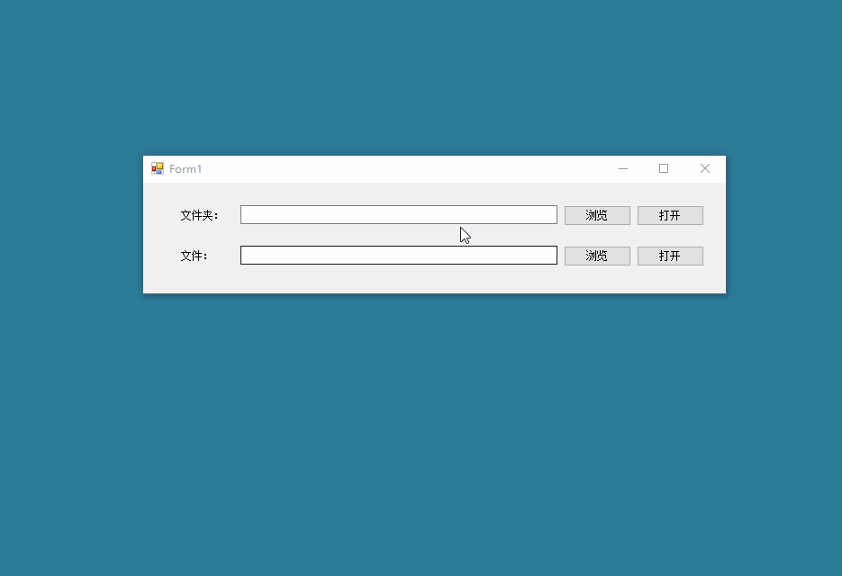

# C# 002 浏览（或叫：选择）、打开 文件和文件夹（或叫：目录） --- Ongoing --- 2016年11月13日 星期日

@(C#)

---


**GitHub**源代码地址：
https://github.com/AoboJaing/Browse_Open_file_folder

---

## 准备工作

设计GUI界面：



---

> 参考网站：
> http://www.cnblogs.com/szytwo/archive/2012/03/21/2410041.html

## 浏览（或叫：选择）文件夹（或叫：目录）

```cs
            FolderBrowserDialog dialog = new FolderBrowserDialog();
            dialog.Description = "请选择文件路径";
            if (dialog.ShowDialog() == DialogResult.OK)
            {
                string foldPath = dialog.SelectedPath;
                textBox1.Text = foldPath;
            }
```

## 打开 文件夹

```cs
            System.Diagnostics.Process.Start("Explorer.exe", textBox1.Text);
```

---

## 浏览（或叫：选择）文件

双击 **Button2**（浏览）按钮，将下面的代码复制到`button2_Click()`事件函数里面：

```cs
            OpenFileDialog fileDialog = new OpenFileDialog();
            fileDialog.Multiselect = true;
            fileDialog.Title = "请选择文件";
            fileDialog.Filter="所有文件(*.*)|*.*";
            if (fileDialog.ShowDialog() == DialogResult.OK)
            {
                string file = fileDialog.FileName;
                textBox2.Text = file;
            }
```

## 打开文件

参考网站：https://zhidao.baidu.com/question/413230762.html

```cs
            //System.Diagnostics.Process.Start("notepad++.exe", textBox2.Text);
            System.Diagnostics.Process.Start("XMP.exe", textBox2.Text);
```

这是一个使用`C#`来使用其他软件打开响应的文件的函数：`System.Diagnostics.Process.Start()`

其他软件：`notepad.exe`是记事本、`notepad++.exe`是**notepad++**文本编辑器软件、`XMP.exe`是迅雷看看播放器软件。


## 运行效果




---


